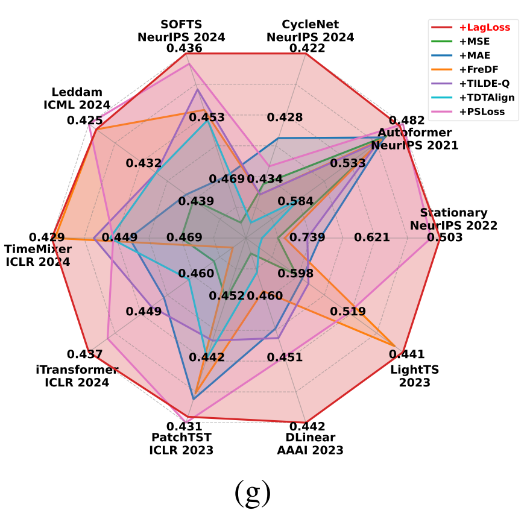

# TimeLagLoss

**Time Lag Loss (LagLoss)** is a new loss function for time-series forecasting that makes the model’s predictions respect the same autocorrelation patterns as the ground-truth signal.


<p align="center">
  
</p>


**Figure (g)**：Comparison of model performance (Metric: MSE) with different loss guides.

---


## 1. 数据集介绍

### 2.1 数据集来源
我们的数据集来源于该[github仓库]([https:](https://github.com/luoyi-hi/time-test))发布的数据集

### 2.2数据集统计信息
Dataset statistics are summarized in Table 1.
##### Table 1: Dataset statistics
<p align="center">
  
</p>

---

## 实验设置与结果概览

- **实验规模**：共 `6（数据集） × 10（模型） × 4（预测步长） × 7（损失） ≈ 1680` 组实验。<!-- TODO：如有变动请修改 -->
- **对比模型**：  
  - Transformer 系：iTransformer、PatchTST、NSTransformer、Autoformer、Informer 等  
  - 线性 / MLP 系：DLinear、SOFTS、TimeMixer、CycleNet、LightTS、Leddam  
- **评价指标**：MSE、MAE（越低越好）；所有实验固定随机种子与训练轮数，保持公平。  

> **结果摘要**  
>
> - 与 MSE 相比，TimeLagLoss 在 **10 / 10** 个模型上平均 **↓ 8.8 % MSE**；在长预测窗 `P = 720` 时提升尤为显著。<!-- TODO：补充真实数字或留空 -->

---

## 如何复现

### 1. 环境安装

```bash
conda create -n ts_lagloss python=3.10 -y
conda activate ts_lagloss
pip install -r requirements.txt
```

### 2. 数据准备

1. 从上表下载 **预处理后** 数据，解压至 `./dataset/`  
2. 若要自行预处理，可执行：

```bash
bash scripts/data_preprocess/prepare_all.sh
```

### 3. 训练与评估

本仓库在 `./scripts/` 目录下提供每组实验的可复现脚本。例如：

```bash
# 以 iTransformer 在 ETTh1 上预测 96 步为例
bash scripts/long_term_forecast/ETTh1/iTransformer.sh
```

> 运行脚本将把日志与指标保存到 `./logs/`，可直接复现实验结果与雷达图数据。

---

## TimeLagLoss 即插即用代码

下方为 **PyTorch** 实现，依赖 `torch.fft`，可直接复制到任意项目中使用：

```python
import torch
import torch.nn.functional as F
from torch.fft import rfft


class TimeLagLoss(torch.nn.Module):
    r"""Plug-and-play TimeLagLoss.

    Args:
        max_k (int): 参与计算的最大 lag 数 (默认 20)
        alpha (float): 均值约束权重 (默认 0.05)
    """
    def __init__(self, max_k: int = 20, alpha: float = 0.05):
        super().__init__()
        self.k = max_k
        self.alpha = alpha

    @staticmethod
    def _topk_lags(y, k):
        """利用 FFT 选取前 k 个显著 lag"""
        amp = torch.mean(torch.abs(rfft(y, dim=-2)), dim=-1)  # (B,C,F)
        diff = torch.diff(amp, dim=-1)
        _, idx = torch.topk(diff, k, dim=-1)                  # (B,C,k)
        seq_len = y.size(-2)
        lags = (seq_len // (idx + 1)).clamp(1, seq_len - 1)
        # 去重并限制数量
        return lags.unique().tolist()[:k]

    def forward(self, y_hat, y_true):
        """y_hat, y_true shape: (B, P, C)"""
        assert y_hat.shape == y_true.shape
        lags = self._topk_lags(y_true, self.k)
        w = torch.ones(len(lags), device=y_true.device) / len(lags)

        lag_loss = 0.0
        for lag, weight in zip(lags, w):
            diff_pred = y_hat[:, lag:, :] - y_hat[:, :-lag, :]
            diff_true = y_true[:, lag:, :] - y_true[:, :-lag, :]
            lag_loss += weight * F.mse_loss(diff_pred, diff_true)

        mean_loss = F.l1_loss(y_hat.mean(dim=1), y_true.mean(dim=1))
        return lag_loss + self.alpha * mean_loss
```

---

## 附录

### A.&nbsp;数据集介绍 <!-- TODO：补充采样频率、维度、划分等 -->

| 数据集 | 采样频率 | 特征维度 | 训练 / 验证 / 测试 | 预测步长 P           |
| :----- | :------- | :------- | :----------------- | :------------------- |
| ETTh1  | 1 hour   | 7        | 12 / 4 / 4 个月    | 96 / 192 / 336 / 720 |
| …      | …        | …        | …                  | …                    |

### B.&nbsp;基线模型与损失 <!-- TODO：补充模型来源与实现细节 -->

- **Transformer 系**  
  - **iTransformer** — _ICLR 2024_  
  - **PatchTST** — _NeurIPS 2023_  
  - …

- **损失函数**  
  - MSE、MAE、Huber、Quantile、SmoothL1、TimeLagLoss (本工作) 等

### C.&nbsp;超参数设置表 <!-- TODO：补参数 -->

| 模型          | 数据集 | P    | Batch / LR | 关键超参     |
| :------------ | :----- | :--- | :--------- | :----------- |
| NSTransformer | ETTh1  | 96   | 32 / 1e-3  | enc=2, dec=1 |
| iTransformer  | ECL    | 336  | 16 / 2e-4  | heads=8      |
| …             | …      | …    | …          | …            |

> **硬件**：全部实验在 1× NVIDIA A100-80GB GPU 上完成。<!-- TODO：或补充训练时长 -->

---

## 引用

若本工作对您有帮助，请引用：

```bibtex
@article{timelagloss_2025,
  title  = {Learning Deep Time Series Models with TimeLagLoss},
  author = {<!-- TODO：作者 -->},
  year   = {2025},
  journal= {arXiv preprint arXiv:2505.xxxxx}
}
```

---

**联系我们**：如有问题或更多实验结果，欢迎提交 [Issue](./issues) 或 PR。  
**许可证**：MIT