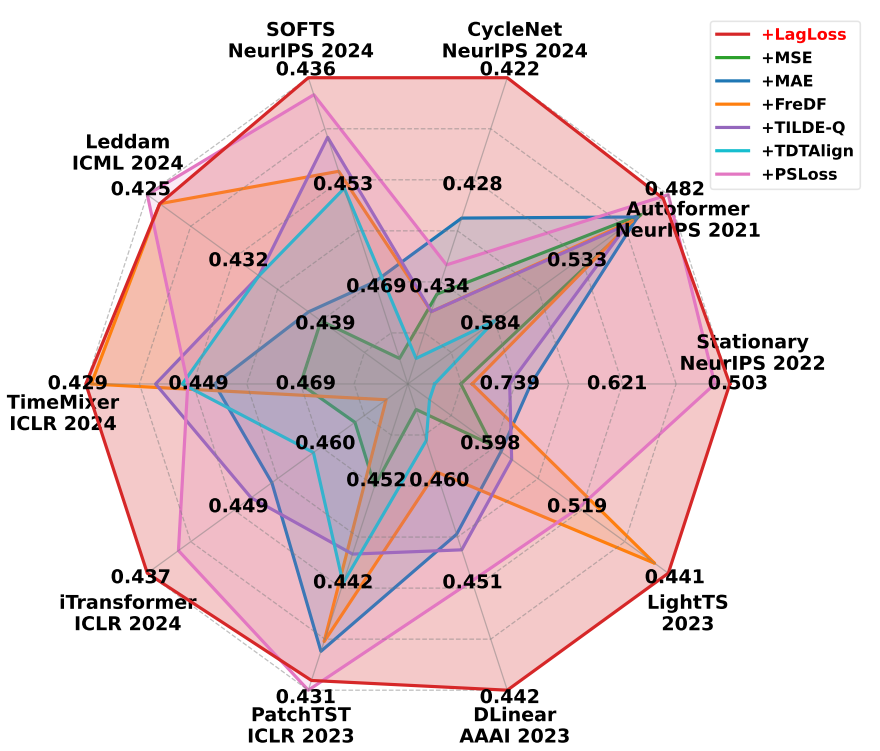
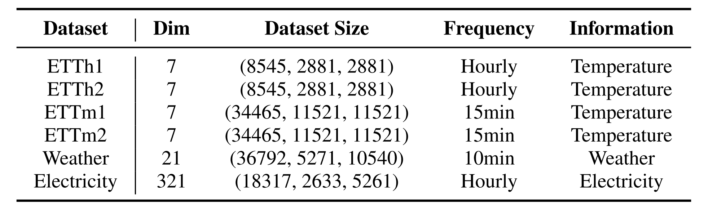
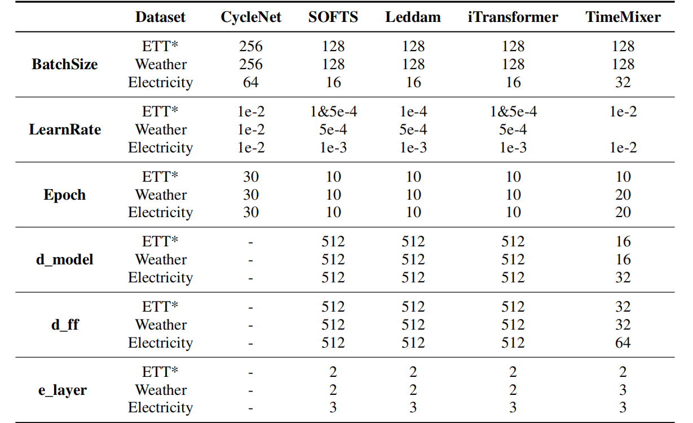
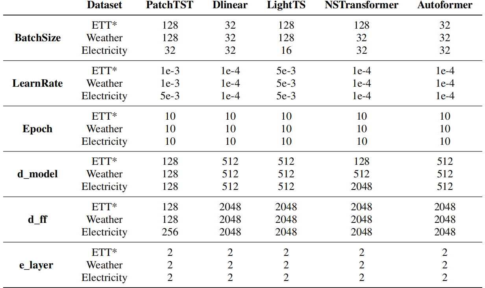

# TimeLagLoss

**Time Lag Loss (LagLoss)** is a novel objective function that encourages predictions to follow the same autocorrelation patterns as the ground truth across multiple lag intervals. It does so by computing lag-specific deviations between the predicted and actual values, using these discrepancies to guide the model's learning process and better capture temporal dependencies.

The workflow of time lag loss is shown in Figure 1, primarily involving differencing sequences of ground truth and prediction, calculating the mean regularization term, selecting lag candidates, and determining lag-specific differences.



<p align="center"><b>Figure&nbsp;1</b> The workflow of LagLoss.</p>

---

## 1. Plug-and-Play Implementation

Below is a pytorch implementation of the LagLoss function.

```python
class TimeLagLoss(nn.Module):
    def __init__(self, args):
        super().__init__()
        self.k = args.top_k              # dominant lags
        self.alpha = args.alpha          # mean‑error weight
        self._point = nn.L1Loss()

    # ----------------------------------------------------------------------
    def _diff(self, x, lag):
        return x if lag == 0 else x[:, lag:] - x[:, :-lag]

    @staticmethod
    def _dedup(lags, val):
        seen, keep = set(), []
        for i, p in enumerate(lags):
            if p not in seen:
                seen.add(p); keep.append(i)
        keep = np.asarray(keep, int)
        return lags[keep], val[keep]

    def _topk_lags(self, x):
        spec = torch.abs(torch.fft.rfft(x, dim=1)).mean(0).mean(-1)
        diff = spec[1:] - spec[:-1]
        _, idx = torch.topk(diff, self.k)
        lags = x.size(1) // (idx + 1)
        lags, vals = self._dedup(lags.cpu().numpy(),
                                    spec[idx + 1].cpu().numpy())
        weight = vals / vals.sum()
        return lags, weight

    # ----------------------------------------------------------------------
    def forward(self, pred, label, hist):
        lags, w = self._topk_lags(label)
        pred_full  = torch.cat([hist, pred],  dim=1)
        label_full = torch.cat([hist, label], dim=1)
        lag_loss = sum(
            wi * self._point(self._diff(pred_full, p),
                             self._diff(label_full, p))
            for p, wi in zip(lags, w)
        )
        mean_loss = self._point(pred.mean(1, keepdim=True),
                                label.mean(1, keepdim=True))
        return lag_loss + self.alpha * mean_loss
```

---

## 2. Experimental Setting

The models and datasets used for the validation experiments are derived from the [Time Series Library (TSLib)](https://github.com/thuml/Time-Series-Library). The appendix reports details of 1680 experimental results covering 4 prediction horizons, 10 models, 7 loss functions, and 6 datasets.

Figure 2 shows an MSE metrics comparison of 10 state-of-the-art time series forecasting models with 7 different loss functions on ETTh1. **Figure 2 shows that the model guided by LagLoss consistently achieves lower MSE values in most models.**


<p align="center"><b>Figure&nbsp;2</b> Comparison of model performance (Metric: MSE) with different loss guides on ETTh1.</p>


### 2.1 Datasets

#### 2.1.1 Sources  

Our data is sourced from the [Time Series Library (TSLib)](https://github.com/thuml/Time-Series-Library) and has been placed in the `./dataset/` directory.

We selected six real-world time series datasets, including ETTh1, ETTh2, ETTm1, and ETTm2, which are the subsets of ETT corpus, Weather, and Electricity.

- **ETT (Electricity Transformer Temperature)**: This dataset includes temperature and power load data from transformers in two regions of China, covering the years 2016 to 2018. The dataset offers two granularities: ETTh (hourly) and ETTm (15-minute intervals).
- **Weather**: This dataset captures 21 meteorological indicators across Germany, recorded every 10 minutes throughout 2020. Key indicators include temperature, visibility, and other parameters, providing a comprehensive view of weather dynamics.
- **Electricity**: This dataset contains hourly electricity consumption records for 321 clients, measured in kilowatt-hours (kWh). Sourced from the UCI Machine Learning Repository, it covers the period from 2012 to 2014, offering valuable insights into consumer electricity usage patterns.


#### 2.1.2 Statistics  

Dataset statistics are summarised in **Table&nbsp;1**.

<p align="center"><b>Table&nbsp;1</b> Statistics of datasets.</p>



### 2.2 Backbone Models  

We have selected ten representative backbones regarding time series forecasting models, encompassing diverse design principles and perspectives:

- **iTransformer(ICLR, 2024)**: Models different variables separately using attention mechanisms and feedforward networks to capture correlations between variables and dependencies within each variable.
- **PatchTST(ICLR, 2023)**: Segments time series into subseries-level patches as input tokens to the Transformer and shares the same embedding and Transformer weights across all series in each channel.
- **NSTransformer(Stationary)(NeurIPS, 2022)**: Consists of Series Stationarization and De-stationary Attention modules to improve the predictive performance of Transformers and their variants on non-stationary time series data.
- **Autoformer(NeurIPS, 2021)**: Based on a deep decomposition architecture and self-correlation mechanism, improving long-term prediction efficiency through progressive decomposition and sequence-level connections.
- **SOFTS(NeurIPS, 2024)**: An efficient MLP-based model with a novel STAR module. Unlike traditional distributed structures, STAR uses a centralized strategy to improve efficiency and reduce reliance on channel quality.
- **CycleNet(NeurIPS, 2024)**: Introduces Residual Cycle Forecasting (RCF), a plug-and-play block that first learns recurrent cycles to explicitly model periodic patterns and then forecasts the residual component with a lightweight Linear layer or shallow MLP.
- **Leddam(ICML, 2024)**: Introduces a learnable decomposition strategy to capture dynamic trend information more reasonably and a dual attention module to capture inter-series dependencies and intra-series variations simultaneously.
- **TimeMixer(ICLR, 2024)**: A fully MLP-based architecture with PDM and FMM blocks to fully utilize disentangled multiscale series in both past extraction and future prediction phases.
- **DLinear(AAAI, 2023)**: Decomposes the time series into trend and residual sequences, and models these two sequences separately using two single-layer linear networks for prediction.
- **LightTS(2023)**: Compresses large ensembles into lightweight models while ensuring competitive accuracy. It proposes adaptive ensemble distillation and identifies Pareto optimal settings regarding model accuracy and size.

### 2.3 Hyper‑Parameters  

Table 2 presents the hyperparameters (batch size, learning rate, number of epochs, model dimensions, feed-forward dimensions, and number of encoder layers) used for 10 time series forecasting models across all datasets, showing dataset- and model-specific configurations for optimization. In particular, **ETT*** refers to the four subsets: ETTh1, ETTh2, ETTm1, and ETTm2.  
**For detailed parameter settings, please refer to the script files in the `./scripts/` folder.**


<p align="center"><b>Table&nbsp;2</b> Hyperparameter configuration.</p>





### 2.4 Loss Function

For the baselines, we selected six loss functions: MSE, MAE, TILDE-Q, FreDF, TDTAlign, and PSLoss. The implementation for each loss can be found in `./utils/losses.py`.

**Implementation Details.** All experiments in this study were implemented within the Time-Series-Library framework. For all models, the look-back length was consistently set to 96. Each dataset's prediction horizons were configured as `{96, 192, 336, 720}`. To maintain fairness, experiments using different loss functions on the same model were conducted with uniform hyperparameters. We follow the settings in their original papers for loss functions that require a combination with MSE. Specifically, for FreDF, we search over `α ∈ {0.25, 0.5, 0.75, 1}`, and for PS Loss, over `α ∈ {1, 3, 5, 10}`. For LagLoss, we search over `α ∈ {0, 0.01, 0.05, 0.1, 0.15, 0.2}`, except for PatchTST, where the range is extended to `{0.3, 0.5, 1}`, and further expanded to `{0.3, 0.4, 0.5}` for the ETTh2 dataset.


---

## 3. Result Reproduction

### 3.1 Environment  

```bash
conda create -n ts_lagloss python=3.10 -y
conda activate ts_lagloss
pip install -r requirements.txt
```

### 3.2 Training & Evaluation  

Example scripts (full list in `./scripts/`):

```bash
# Autoformer on ETT datasets
bash scripts/long_term_forecast/ETT_script/Autoformer.sh
# Autoformer on Electricity dataset
bash scripts/long_term_forecast/ECL_script/Autoformer.sh
# Autoformer on Weather dataset
bash scripts/long_term_forecast/Weather_script/Autoformer.sh
# DLinear on ETT datasets
bash scripts/long_term_forecast/ETT_script/DLinear.sh
# DLinear on Electricity dataset
bash scripts/long_term_forecast/ECL_script/DLinear.sh
# DLinear on Weather dataset
bash scripts/long_term_forecast/Weather_script/DLinear.sh
# iTransformer on ETT datasets
bash scripts/long_term_forecast/ETT_script/iTransformer.sh
# iTransformer on Electricity dataset
bash scripts/long_term_forecast/ECL_script/iTransformer.sh
# iTransformer on Weather dataset
bash scripts/long_term_forecast/Weather_script/iTransformer.sh
# Leddam on ETT datasets
bash scripts/long_term_forecast/ETT_script/Leddam.sh
# Leddam on Electricity dataset
bash scripts/long_term_forecast/ECL_script/Leddam.sh
# Leddam on Weather dataset
bash scripts/long_term_forecast/Weather_script/Leddam.sh
# LightTS on ETT datasets
bash scripts/long_term_forecast/ETT_script/LightTS.sh
# LightTS on Electricity dataset
bash scripts/long_term_forecast/ECL_script/LightTS.sh
# LightTS on Weather dataset
bash scripts/long_term_forecast/Weather_script/LightTS.sh
# NSTransformer on ETT datasets
bash scripts/long_term_forecast/ETT_script/Nonstationary_Transformer.sh
# NSTransformer on Electricity dataset
bash scripts/long_term_forecast/ECL_script/Nonstationary_Transformer.sh
# NSTransformer on Weather dataset
bash scripts/long_term_forecast/Weather_script/Nonstationary_Transformer.sh
# PatchTST on ETT datasets
bash scripts/long_term_forecast/ETT_script/PatchTST.sh
# PatchTST on Electricity dataset
bash scripts/long_term_forecast/ECL_script/PatchTST.sh
# PatchTST on Weather dataset
bash scripts/long_term_forecast/Weather_script/PatchTST.sh
# SOFTS on ETT datasets
bash scripts/long_term_forecast/ETT_script/SOFTS.sh
# SOFTS on Electricity dataset
bash scripts/long_term_forecast/ECL_script/SOFTS.sh
# SOFTS on Weather dataset
bash scripts/long_term_forecast/Weather_script/SOFTS.sh
# TimeMixer on ETT datasets
bash scripts/long_term_forecast/ETT_script/TimeMixer.sh
# TimeMixer on Electricity dataset
bash scripts/long_term_forecast/ECL_script/TimeMixer.sh
# TimeMixer on Weather dataset
bash scripts/long_term_forecast/Weather_script/TimeMixer.sh
# For detailed instructions on using CycleNet with TimeLagLoss, please refer to `./CycleNet-LagLoss/Readme.md`.
```

---

