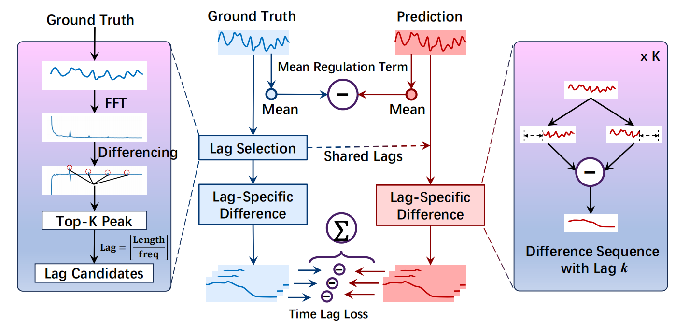

# TimeLagLoss

Our model implementation and datasets are derived from the [Time Series Library (TSLib)](https://github.com/thuml/Time-Series-Library).We conducted over 1,440 experiments using a total of 10 models, 6 loss functions, and 6 datasets.

**Time Lag Loss (LagLoss)** is a novel objective function that encourages predictions to follow the same autocorrelation patterns as the ground truth across multiple lag intervals. It does so by computing lag-specific deviations between the predicted and actual values, using these discrepancies to guide the model's learning process and better capture temporal dependencies.


<p align="center"><b>Figure&nbsp;1</b> The workflow of LagLoss.</p>

The workflow of time lag loss is shown as Figure 1, primarily involving differencing sequences of ground-truth and prediction, calculating the mean regularization term, selecting lag candidates, and determining lag-specific differences.


<p align="center"><b>Figure&nbsp;2</b> Comparison of model performance (Metric: MSE) with different loss guides.</p>

Figure 2 Radar chart comparing the MSE performance of 10 state-of-the-art time series forecasting models across 7 different loss functions. Each line represents a distinct loss function (e.g., MSE, MAE, TILDE-Q, etc.), including our proposed LagLoss (in red). The chart shows that models guided by LagLoss consistently achieve lower MSE values across the majority of models

---

## 1. Plug-and-Play LagLoss Function

（代码命名，周期改成lag，代码的命名要合理）
```python
class TimeLagLoss(nn.Module):
    def __init__(self, args):
        super().__init__()
        self.k = args.top_k              # dominant lags
        self.alpha = args.alpha          # mean‑error weight
        self._point = nn.L1Loss()

    # ----------------------------------------------------------------------
    def _diff(self, x, lag):
        return x if lag == 0 else x[:, lag:] - x[:, :-lag]

    @staticmethod
    def _dedup(period, val):
        seen, keep = set(), []
        for i, p in enumerate(period):
            if p not in seen:
                seen.add(p); keep.append(i)
        keep = np.asarray(keep, int)
        return period[keep], val[keep]

    def _topk_periods(self, x):
        spec = torch.abs(torch.fft.rfft(x, dim=1)).mean(0).mean(-1)
        diff = spec[1:] - spec[:-1]
        _, idx = torch.topk(diff, self.k)
        periods = x.size(1) // (idx + 1)
        periods, vals = self._dedup(periods.cpu().numpy(),
                                    spec[idx + 1].cpu().numpy())
        weight = vals / vals.sum()
        return periods, weight

    # ----------------------------------------------------------------------
    def forward(self, pred, label, hist):
        periods, w = self._topk_periods(label)
        if 2 in periods and 1 not in periods:
            periods = np.append(periods, 1)
            w = np.append(w, w[periods == 2])
            w /= w.sum()

        pred_full  = torch.cat([hist, pred],  dim=1)
        label_full = torch.cat([hist, label], dim=1)

        lag_loss = sum(
            wi * self._point(self._diff(pred_full, p),
                             self._diff(label_full, p))
            for p, wi in zip(periods, w)
        )
        mean_loss = self._point(pred.mean(1, keepdim=True),
                                label.mean(1, keepdim=True))
        return lag_loss + self.alpha * mean_loss
```

---

## 2. Experimental Setting

### 2.1 Datasets

#### 2.1.1 Sources  

Our data is sourced from the [Time Series Library (TSLib)](https://github.com/thuml/Time-Series-Library) and has been placed in the `./dataset/` directory.

we selected six real-world time series datasets, including ETTh1, ETTh2, ETTm1, ETTm2 which are the subsets of ETT corpus, Weather and Electricity.

- **ETT (Electricity Transformer Temperature)**: This dataset includes temperature and power load data from transformers in two regions of China, covering the years 2016 to 2018. The dataset offers two granularities: ETTh (hourly) and ETTm (15-minute intervals).
- **Weather**: This dataset captures 21 different meteorological indicators across Germany, recorded every 10 minutes throughout the year 2020. Key indicators include temperature, visibility, and other parameters, providing a comprehensive view of weather dynamics.
- **Electricity**: This dataset contains hourly electricity consumption records for 321 clients, measured in kilowatt-hours (kWh). Sourced from the UCI Machine Learning Repository, it covers the period from 2012 to 2014, offering valuable insights into consumer electricity usage patterns.

#### 2.2.2 Statistics  

Dataset statistics are summarised in **Table&nbsp;1**.

<p align="center"><b>Table&nbsp;1</b> Statistics of datasets.</p>


### 2.2 Backbone Models  

We have selected ten representative backbone regarding time series forecasting models, encompassing diverse design principles and perspectives:

- **iTransformer(ICLR 2024)**: Models different variables separately using attention mechanisms and feedforward networks to capture correlations between variables and dependencies within each variable.
- **PatchTST(ICLR 2023)**: Segments time series into subseries-level patches as input tokens to Transformer and shares the same embedding and Transformer weights across all series in each channel.
- **NSTransformer(NeurIPS 2022)**: Consists of Series Stationarization and De-stationary Attention modules to improve the predictive performance of Transformers and their variants on non-stationary time series data.
- **Autoformer(NeurIPS 2021)**: Based on a deep decomposition architecture and self-correlation mechanism, improving long-term prediction efficiency through progressive decomposition and sequence-level connections.
- **SOFTS(NeurIPS 2024)**: An efficient MLP-based model with a novel STAR module. Unlike traditional distributed structures, STAR uses a centralized strategy to improve efficiency and reduce reliance on channel quality.
- **Leddam(ICML 2024)**: Introduces a learnable decomposition strategy to capture dynamic trend information more reasonably and a dual attention module to capture inter-series dependencies and intra-series variations simultaneously.
- **TimeMixer(ICLR 2024)**: A fully MLP-based architecture with PDM and FMM blocks to fully utilize disentangled multiscale series in both past extraction and future prediction phases.
- **DLinear(AAAI 2023)**: Decomposes the time series into trend and residual sequences, and models these two sequences separately using two single-layer linear networks for prediction.
- **TSMixer(ICLR 2024)**: A novel architecture designed by stacking MLPs, based on mixing operations along both the time and feature dimensions to extract information efficiently.
- **LightTS(2023)**: Compresses large ensembles into lightweight models while ensuring competitive accuracy. It proposes adaptive ensemble distillation and identifies Pareto optimal settings regarding model accuracy and size.

### 2.3 Hyper‑parameters  

Table 2 presents the hyperparameters (batch size, learning rate, number of epochs, model dimensions, feed-forward dimensions, and number of encoder layers) used for 10 time series forecasting models across all datasets, showing dataset- and model-specific configurations for optimization. In particular, **ETT*** refers to the four subsets: ETTh1, ETTh2, ETTm1, and ETTm2.  
For detailed parameter settings, please refer to the script files in the `scripts` folder.


<p align="center"><b>Table&nbsp;2</b> Hyperparameter configuration.</p>


### 2.4 Loss Function
For the baselines, we selected six loss functions, including MSE, MAE, TILDE-Q, FreDF, TDTAlign, and PSLoss. The implementation for each loss can be found in `utils\losses.py`.

**Implementation Details.** All experiments in this study were implemented within the Time-Series-Library framework. For all models, the look-back length was consistently set to 96. For each dataset, the prediction horizons were configured as {96, 192, 336, 720}. To maintain fairness, experiments using different loss functions on the same model were conducted with uniform hyperparameters. For loss functions that require combination with MSE, we follow the settings provided in their original papers. Specifically, for FreDF, we search over $\alpha \in \{0.25, 0.5, 0.75, 1\}$, and for PS Loss, over $\alpha \in \{1, 3, 5, 10\}$. For LagLoss, we search over $\alpha \in \{0, 0.01, 0.05, 0.1, 0.15, 0.2\}$, with one exception for PatchTST, where the search range is extended to include $\{0.3, 0.5, 1\}$.


---

## 4. Result Reproduction

Code is based on Time Series Library (TSLib), and the datasets are also obtained from this library: https://github.com/thuml/Time-Series-Library

### 4.1 Environment  

```bash
conda create -n ts_lagloss python=3.10 -y
conda activate ts_lagloss
pip install -r requirements.txt
```

### 4.2 Training & Evaluation  

Example scripts (full list in `./scripts/`): (对每个方法弄示例，超参范围标注,cyc那个单独说明)

```bash
# iTransformer on ETTh1, horizon 96
bash scripts/long_term_forecast/ETT_script/iTransformer.sh
```

---
